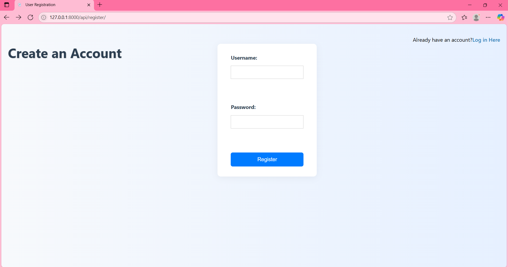
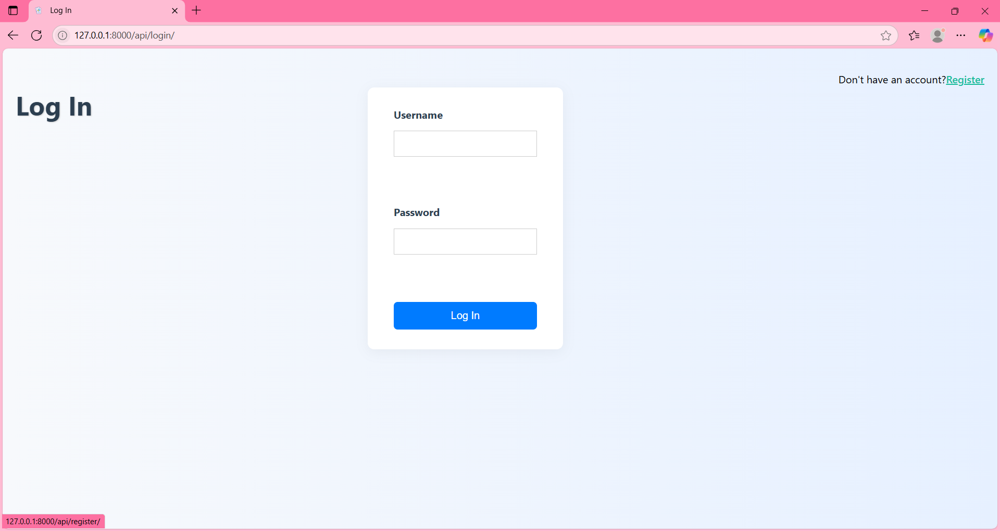
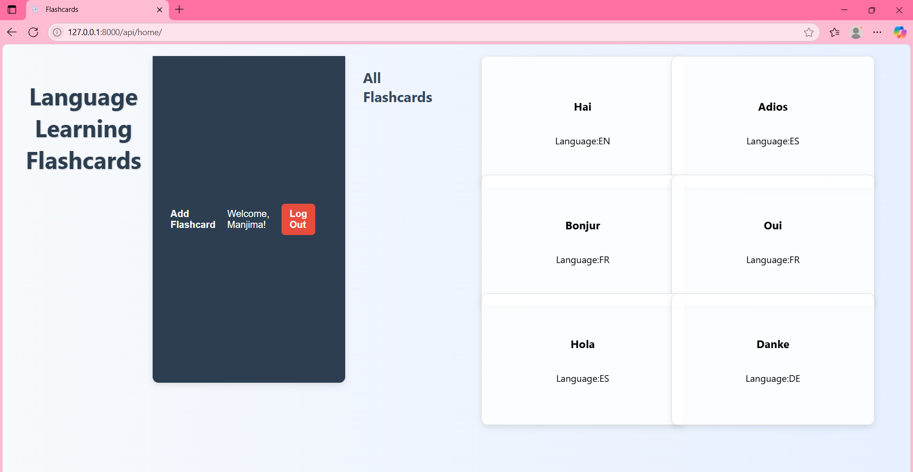
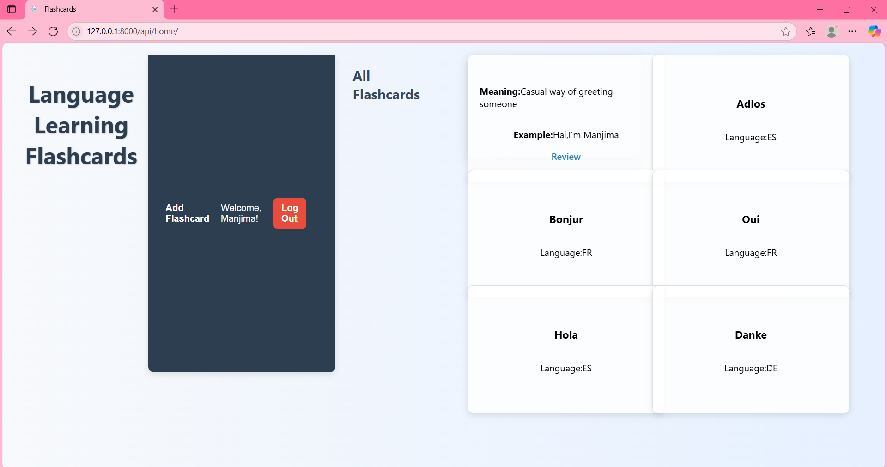
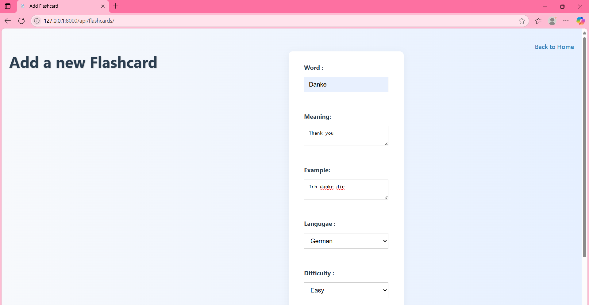
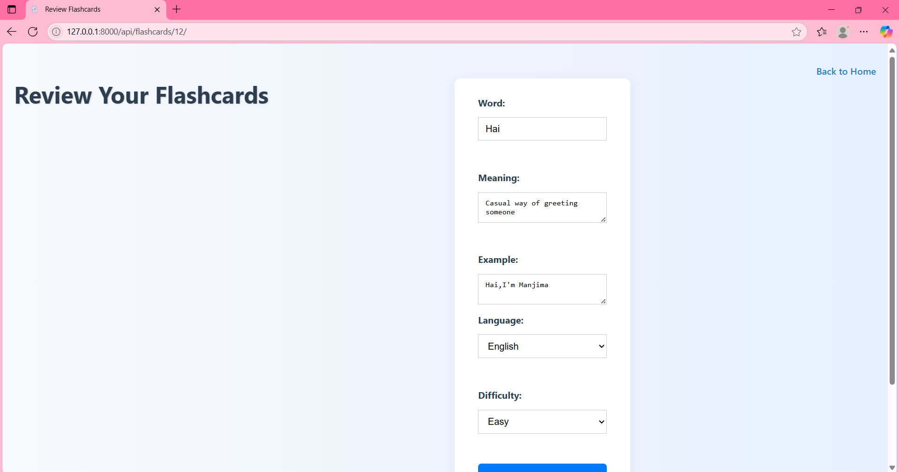

# 🧠 Language Flashcards App

A Django-based web application that helps users learn and review vocabulary through interactive flashcards. It supports full user authentication, CRUD operations, and RESTful APIs for flexible front-end interaction using JavaScript.

---

## 💻 Technologies Used

- Python  
- Django  
- Django REST Framework (DRF)  
- HTML & CSS  
- JavaScript  
- MySQL  
- RESTful APIs  

---

## 🔑 Key Features

- ✅ User authentication (register, login, logout)  
- ✅ Create, read, update, and delete flashcards  
- ✅ RESTful API endpoints for flashcard operations  
- ✅ Interactive flashcard review using JavaScript  
- ✅ MySQL database for persistent storage  
- ✅ Clean user interface  

---

## 📡 API Endpoints

| Method | Endpoint | Description |
|--------|----------|-------------|
| `POST` | `/api/register/` | Register a new user |
| `POST` | `/api/login/` | Login for existing users |
| `GET`  | `/api/home/` | Get all flashcards of the logged-in user |
| `POST` | `/api/flashcards/` | Create a new flashcard |
| `PUT`  | `/api/flashcards/<int:pk>/` | Update a specific flashcard |
| `DELETE` | `/api/flashcards/<int:pk>/` | Delete a specific flashcard |

---

## 🔐 Authentication & Authorization

This project uses **Django REST Framework** and **django-allauth** for robust user authentication:

- `django-allauth`: Manages user registration, login.  
- `rest_framework.authtoken`: Provides token-based authentication for secure API access.

---

## 📷 Screenshots

Here’s a quick look at some of the key screens in the app:

- 📌 **User Registration Page**  
  

- 🔐 **Login Page**  
  

- 🏠 **Homepage**  
  

- 🔄 **Flipping a Flashcard**  
  

- ➕ **Add New Flashcard**  
  

- 📋 **Review Page**  
  

---
